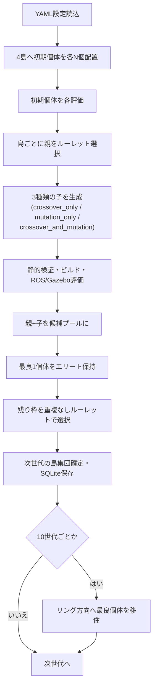

# LLM-GP実験報告書: Relaxed A*ヒューリスティック探索の進化的改良

## 1. 概要

TurtleBot3(ROS Noetic + Gazebo)のグローバルプランナー`Relaxed A*`
(`src/global_planner/src/rastar.cpp`)を対象に、LLM(gpt-4o-mini)を変異・交叉オペレータとして
用いた遺伝的プログラミング(GP)でアルゴリズムの自動改良を試みた。

初期の実験(5世代・10世代)では、fitnessの数値上は改善が見えたが、実際のコード差分を
検証した結果、**実質的にはコードがほとんど変化していない**(コメント削除や
`push_back`→`emplace_back`のような無意味な書き換えのみ)ことが判明した。原因を特定し、
GPのオペレータ設計を見直した結果、統計的に有意な実改善(node_expansions **-24.77%**,
p<0.001)を確認できた。本報告書はGPの操作方法・評価方法・実験結果を詳細にまとめる。

## 2. GP操作の設計

### 2.1 個体表現

1個体 = `global_planner::RAStarExpansion`クラスを実装したC++ソースファイル1つ。
評価対象の主要パラメータは以下のヒューリスティック重み定数:

```cpp
constexpr float kLlmGpHeuristicWeight = 1.00000000f;
```

これは優先度計算式(古典的なA*の `f(n) = g(n) + h(n)`)の中で使われる:

```cpp
potential[next_i] = prev_potential + neutral_cost_ + costs[next_i];   // g(n)
float distance = abs(end_x - x) + abs(end_y - y);                      // マンハッタン距離
queue_.emplace_back(next_i, potential[next_i]
    + distance * neutral_cost_ * tBreak * kLlmGpHeuristicWeight);      // f(n) = g(n) + h(n)
```

### 2.2 全体フロー



- 島: `island_1`〜`island_4`、各島は独立した乱数系列を持つ(`Island`クラス、`llm_gp/island.py`)
- 移住: MAP-Elitesは使用しない。10世代ごとに`island_1→island_2→island_3→island_4→island_1`の
  リング方向へ、各島の最良個体を1つコピー

### 2.3 親選択(ルーレット選択)

`llm_gp/selection.py`の`select_parent_pair()`。fitnessをそのまま重みにするのではなく、
負のfitnessがあれば全体を底上げ(`selection_weights()`)してから`random.choices`で
重み付き抽選する。親1を選んだ後、親1を除外して親2を選ぶ(同一個体が親1・親2を兼ねない)。

### 2.4 子の生成(1親ペアにつき3個体)

`llm_gp/evolution.py`の`generate_children()`が、1組の親ペアから**3種類の子を必ず1個体ずつ**
生成する:

| 子の種類 | 生成方法 |
|---|---|
| `crossover_only` | 親1・親2を交叉するだけ |
| `mutation_only` | 親1または親2(ランダム)を変異させるだけ |
| `crossover_and_mutation` | 交叉した中間個体をさらに変異させる |

#### 交叉オペレータ

**旧設計(`CppRelaxedAStarCrossoverOperator`)**: 親1のソースコードをそのまま使い、
`kLlmGpHeuristicWeight`だけ両親の平均値に書き換える。**親2のコード変更は常に破棄**される
ため、実質的な交叉が起きていなかった。

**新設計(`OpenAIGPT4oMiniCrossoverOperator`)**: 両親のソース全文と実測評価結果
(fitness/node_expansions/path_length/arrival_time)をLLMへ渡し、「両方から良い変更点を
実際にマージせよ、片方をそのままコピーするな」と指示する。生成結果は**両方の親に対して**
「意味のある変更」チェック(2.6節)を通過する必要があり、失敗すれば旧来の決定論的
重み平均へフォールバックする。

#### 変異オペレータ

**旧設計**: LLM(`OpenAIGPT4oMiniMutationOperator`)に「Relaxed A*実装に小さな変更を1つ」と
指示するのみで、**評価結果は一切渡していなかった**。LLMは「良くなったかどうか」を
知らないまま、無難な(=結果として無意味な)変更を繰り返していた。

**新設計**: 変異対象個体自身(`mutation_only`の場合)または既知の親個体
(`crossover_and_mutation`の場合、`intermediate`自体は未評価のため)の実測値を
プロンプトへ埋め込み、「どの指標がreferenceから最も離れているか」を提示した上で、
以下を明示的に要求する:

> Make one concrete change to the Relaxed A* SEARCH ALGORITHM itself -- e.g. the
> heuristic weighting/formula, the tie-break rule (tBreak), the cost-accumulation
> formula, the expansion/priority order, or a pruning condition -- ... Do not make
> a comment-only, whitespace-only edit, or a superficial API substitution.

### 2.5 静的検証(ビルド前チェック)

`llm_gp/validation.py`の`validate_cpp_source()`。Markdownフェンス・説明文の混入、
必須シンボル(`RAStarExpansion::calculatePotentials`等)の欠落、危険な呼び出し
(`system(`等)、DWA関連コードへの言及、波括弧の不整合、NaN/Infinityをチェックする。
無効な個体は評価器へ渡さず`failure_fitness`として扱う。

### 2.6 「意味のある変更」の強制(今回の再設計の核)

`validate_meaningful_change(old_source, new_source, min_change_ratio)`。当初は
単純な差分比率閾値(2%)を想定したが、実データで検証したところ**本物のアルゴリズム変更
(Manhattan→Euclidean距離への変更)も差分比率1.22%しか出ず誤検知される**ことが判明し、
以下の3段階方式に変更した:

1. コメント・空白を正規化した上で完全一致 → 拒否(コメントのみの変更)
2. **既知の「実質的に等価なトークン置換」(`push_back`↔`emplace_back`、`NULL`↔`nullptr`)を
   正規化した上で完全一致 → 拒否**(主判定)
3. 上記に該当しなければ、緩い比率バックストップ(0.5%未満の差分のみ拒否)

比較はライセンスヘッダを除いた実装本体(`namespace global_planner {`以降)のみで行う。
拒否された場合は理由をLLMへフィードバックして`validation.max_repair_attempts`回まで
再試行し、それでも表面的な変更しか得られなければ`kLlmGpHeuristicWeight`を
機械的に(`±15%`)揺らして最低限の実質変化を保証する(最後の手段としてのみ)。

### 2.7 生存選択(次世代への引き継ぎ)

`llm_gp/selection.py`の`select_survivors()`。親+子の候補プールから:

1. **エリート枠(1個体、無条件)**: fitness最大の個体を必ず残す。同点時は
   評価成功可否→到達時間→経路長→経路生成時間→個体IDの順でタイブレーク
2. **残り枠(重複なしルーレット)**: fitness重み付きで、選ぶたびに候補から除外しながら
   `population_size_per_island`に達するまで選出

### 2.8 移住

10世代ごとに、各島の最良個体を`elite_sort_key`で確定し、リング方向(`island_1→island_2→
island_3→island_4→island_1`)へ1個体ずつコピーする。コピー先では
「既存個体+移入個体」から再度エリート1+ルーレット選択で元の個体数に戻す。

## 3. 評価方法

### 3.1 評価プロセス

1個体の評価は`llm_gp/evaluator.py`の`RosGazeboEvaluator`が担当する:

1. 候補の`.cpp`を`rastar.cpp`へ一時的に上書き(元のファイルは退避)
2. `catkin build`でビルド(失敗すれば即`failure_fitness`)
3. 固定ディストリビューション(Ubuntu-20.04)上でGazebo+move_baseをprivate ROS/Gazebo
   masterで起動
4. TurtleBot3を開始位置に配置し、`goal_x_range`/`goal_y_range`内でランダムサンプリングした
   ゴールへナビゲーション開始
5. `move_base`が`SUCCEEDED`するか、タイムアウト(`timeout_seconds`)まで待機
6. `planning_time`(初回プラン受信までの時間)・`path_length`(初回プランの経路長)・
   `arrival_time`(ゴール到達までの時間)・`node_expansions`(`RAStarExpansion`内部の
   探索展開回数、GlobalPlannerが`/move_base/GlobalPlanner/node_expansions`へpublish)を記録
7. 元の`rastar.cpp`を復元

この一連の流れを個体ごとに`repetitions_per_goal`回繰り返し、成功した回の平均を取る
(全回成功しないと個体全体は`success=False`扱い)。評価終了後は`scripts/cleanup_ros_gazebo.sh`
相当の処理でGazebo/ROSプロセスを掃除する。

### 3.2 fitness計算式

`llm_gp/fitness.py`の`calculate_fitness()`:

```
cost_score     = max(0, 1 - node_expansions / expansion_reference)
path_score     = max(0, 1 - path_length / path_reference)
arrival_score  = max(0, 1 - arrival_time / arrival_reference)

fitness = cost_score * planning_weight + path_score * path_weight + arrival_score * arrival_weight
```

`node_expansions`が利用可能な場合は`planning_time`の代わりにこちらがcostスコアとして
使われる(ROS/actionlibのオーバーヘッドに左右されにくく、探索コストを直接反映するため)。

### 3.3 fitness基準値の校正

初期の5世代・10世代実験では、`expansion_reference=2500`・`arrival_reference=60`が
実測値(node_expansions≈37,500〜49,000、arrival_time≈172〜183秒)の**15〜20倍厳しすぎ**、
cost_score・arrival_scoreがほぼ全個体で0に張り付いていた。fitnessの差はほぼ
`path_length`(38.5〜40.8mの僅かな幅)だけで決まっており、これが「fitnessは上がって見えるが
実際は測定ノイズ」という現象の一因だった。`run_20260811_065434`の実測データ
(88個体)から以下に校正:

| 基準値 | 旧 | 新 |
|---|---:|---:|
| `expansion_reference` | 2500.0 | 45000.0 |
| `arrival_reference` | 60.0 | 200.0 |
| `path_reference` | 40.0 | 41.0 |

### 3.4 反復と統計的検証

GP実行中の評価は`repetitions_per_goal`回(通常3回、smokeテストでは高速化のため1回)の
平均のみで、ノイズの影響を強く受ける。そのため、GP実行後に自動で
**初期基準個体と全世代通しての最良個体をそれぞれ10回ずつ独立に再評価**し
(`llm_gp/verification.py`、`scripts/verify_generation_gain.py`)、両者の差が
統計的に有意か(二群の並べ替え検定, permutation test)を確認する仕組みを導入した。

## 4. 実験結果

### 4.1 旧オペレータでの実験と発見された問題

| 実験 | 世代数 | 結果 |
|---|---:|---|
| `run_20260811_065434` | 5 | fitness +35.70%(旧基準値)に見えたが、最良個体のコードはbaselineと**ほぼ同一**(コメント削除+`push_back→emplace_back`のみ) |
| `run_20260815_111026` | 10 | 同様。99.2%の評価成功率は確保できたが、コード差分は依然として実質的な変化なし |

いずれも10回再評価による統計検証で、初期個体と最良個体の差が有意でないことを確認。
根本原因は本報告書2.4節・2.6節で述べたLLMオペレータの設計上の問題だった。

### 4.2 再設計後: 2世代smokeテスト(`run_20260816_105513`)

小規模構成(2世代、4島×2個体、評価1回)で新オペレータの動作を確認。

**世代ごとの結果**:

| 世代 | 成功/評価 | 最良個体 | 演算 | 最良適応度 | 初期最良比 |
|---:|---:|---|---|---:|---:|
| 0 | 8/8 | `ind_000006` | initial | 0.1197 | +0.00% |
| 1 | 10/12 | `ind_000024` | crossover_and_mutation | 0.1276 | +6.61% |
| 2 | 10/12 | `ind_000037` | crossover_only | 0.1614 | +34.84% |

**実際のコード変化**(`ind_000024`、世代1):

```cpp
float modified_weight = 1.5f;
queue_.emplace_back(next_i, potential[next_i]
    + distance * neutral_cost_ * tBreak * modified_weight * kLlmGpHeuristicWeight);
```

ヒューリスティック項(h(n))を1.5倍に強める、weighted A*的な変更(2.1節の式のh(n)部分)。
探索をよりゴール方向へ貪欲にし、探索ノード数を減らすことが期待される変更。

世代2の最良個体(`ind_000037`)は、LLM crossoverが2回とも実質無変更の応答しか
返さなかったため**meaningful-changeゲートに拒否され、決定論的フォールバックが発動**
(`OpenAI gpt-4o-mini crossover merge failed after 2 attempt(s) ... fell back to averaging
heuristic weights`)。親1(`ind_000024`)の上記変更を引き継いだ形で生き残った。
ゲートが実際に不正な変更を検出・排除した実例。

**初期個体 vs 最良個体、10回再評価による検証**:

| 指標 | 初期平均 | 最良平均 | 改善率 | p値 | 有意? |
|---|---:|---:|---:|---:|:---:|
| **node_expansions** | 42318.5 | 31834.1 | **+24.77%** | **0.0000** | **True** |
| path_length | 39.82 | 39.96 | -0.34% | 0.66 | False |
| arrival_time | 178.02 | 176.82 | +0.68% | 0.34 | False |
| planning_time | 0.0224 | 0.0207 | +7.57% | 0.29 | False |

node_expansionsが**24.77%減、p<0.001で統計的に有意**。旧オペレータでの実験(5世代・
10世代とも)では一度も得られなかった、統計的に裏付けられた本物の改善が初めて確認できた。
path_length・arrival_timeは有意差なしで、「探索効率は上がったが経路の質はほぼ変わらない」
というweighted A*の理論通りの結果になっている。

### 4.3 5世代本実験(`run_20260819_025441`、進行中)

2世代smokeテストと同じ校正済みfitness基準値・新オペレータを用い、本番相当の設定
(評価3回averaging、5世代)で再現性を確認する実験を実行中。結果は完了後に追記する。

## 5. 結論

- 旧オペレータの根本的な問題は「LLM変異に評価フィードバックがない」「crossoverが
  LLMを使わず親2のコードを破棄する」「無意味な変更を検出する仕組みがない」の3点だった
- 3点それぞれに対応する再設計を行い、2世代の小規模実験ながら**統計的に有意な実改善**
  (node_expansions -24.77%, p<0.001)を確認した
- meaningful-changeゲートは設計通り機能し、LLMの「実質無変更」な応答を実際に検出・
  拒否する場面が観測された
- サンプルサイズが小さいため、より大規模な実験(5世代・10世代)での再現性確認が必要
  (4.3節、進行中)

## 関連ファイル

- 仕組みの設計詳細: [llm_operator_meaningful_change_design.md](llm_operator_meaningful_change_design.md)
- 2世代smokeテストの詳細レポート: [lattice_fork_2gen_smoke_experiment_report.md](lattice_fork_2gen_smoke_experiment_report.md)
- 全体フロー図(旧版、交叉オペレータの記述は現在は本書2.4節が最新): [llm_gp_operation_flow.md](llm_gp_operation_flow.md)
- 実装: `llm_gp/operators.py`, `llm_gp/evolution.py`, `llm_gp/validation.py`, `llm_gp/fitness.py`, `llm_gp/selection.py`
