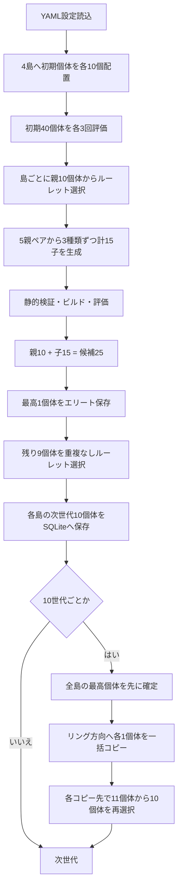

# LLM-GPルーレット選択・4島モデル 動作フロー

## 全体



## 対象

- 改変対象: `src/global_planner/src/rastar.cpp`のRelaxed A*
- 固定: `dwa_local_planner/DWAPlannerROS`
- 島: `island_1`〜`island_4`
- 各島: 10個体、独立乱数系列
- MAP-Elites: 使用しない

## 親選択

適応度を非負重みに補正してルーレット選択します。親2は親1を除外して選びます。
同一個体は別の親ペアでは再び選択され得ます。全重みが実質0なら一様選択します。

## 子生成

各親ペアから`crossover_only`、`mutation_only`、`crossover_and_mutation`を1個ずつ
生成します。1島5ペアで15個体、4島で毎世代60個体です。

## 次世代選択

候補25個体の最高適応度個体を必ず残します。同点なら評価成功、到達時間、経路長、
経路生成時間、個体IDの順で決定します。残り9個体は重複なしルーレットで選びます。

## 移住

10、20、30、…世代で次の方向へ最高1個体をコピーします。

```text
island_1 → island_2 → island_3 → island_4 → island_1
```

全コピー元を確定してから一括処理するため、同一移住内の多段コピーは発生しません。
コピー先では10＋1個体から再びエリート1＋ルーレット9を選び、10個体へ戻します。

## 検証と評価

生成コードに説明文、Markdown、危険操作、NaN/Inf、DWA参照がないことと、Relaxed A*の
必須APIを確認します。無効個体は評価器へ渡しません。ROS設定ではcatkinビルド成功後だけ
Gazeboを起動し、固定ゴール`[1.69, 0.954, -0.00143]`へ3回走行した平均を使います。

## 保存

SQLiteには全個体、評価、世代母集団、移住、変更履歴、LLM呼び出しを保存します。
不採用個体も削除しません。CSVには世代ごとの各島母集団数と最高適応度を保存します。
