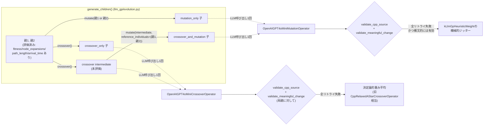

# LLMオペレータ再設計: フィードバック・意味のある変更・LLM交叉

## 背景

`run_20260811_065434`(5世代)・`run_20260815_111026`(10世代)の実験結果を検証したところ、
世代を重ねてもfitnessが上昇して見えるのに、実際のコード差分はコメント削除と
`push_back`→`emplace_back`という**実質no-opな書き換え**のみだった。原因は3つ:

1. LLM変異に評価結果(fitness/node_expansions/path_length/arrival_time)が一切渡されておらず、
   LLMは「良くなったかどうか」を知らないまま毎回無難な変更しか出さない
2. LLMへの指示が「小さな変更を1つ」とだけで、変更が実質的(non-trivial)かどうかの
   チェックが存在しないため、無意味な書き換えでもそのまま採用されていた
3. crossoverがLLMを使わず、親1のコードをそのまま使って重み(`kLlmGpHeuristicWeight`)だけ
   平均するため、親2のコードの変化は常に捨てられ、実質的な交叉が一度も起きていなかった

このドキュメントは、それを解消するために再設計した3つの仕組みをまとめる。

## 全体像



## 1. フィードバック付きLLM変異

`llm_gp/operators.py`の`_metrics_block()`が、既知の評価結果をプロンプトへ整形して埋め込む。

- `mutation_only`: `mutate()`に渡される`individual`は既に評価済みなので、その`fitness`/
  `node_expansions`/`path_length`/`arrival_time`をそのまま使う
- `crossover_and_mutation`: mutateされる`intermediate`は未評価(`fitness is None`)なので、
  代わりに`MutationContext.reference_individuals`(=親1, 親2)の評価結果を使う
  (`llm_gp/evolution.py`の`generate_children()`が明示的に渡す)

各指標は`FitnessSettings`の`*_reference`と比較した形で提示され、「どの指標が
referenceから最も離れているか(=改善余地が大きいか)」をLLMが判断できるようにする。

```python
# _metrics_block()が生成する例
"""
Known evaluation results (lower is better for every metric below; the metric
currently furthest above its reference has the most room to improve fitness):
- ind_000006 (fitness=0.1197): node_expansions=4.232e+04 (reference 4.5e+04,
  at/below reference), path_length=38.76 (reference 41, at/below reference),
  arrival_time=171.1 (reference 200, at/below reference)
Prioritize the metric that is furthest above its reference; do not regress the others.
"""
```

指示文自体も「小さな変更を1つ」から、**アルゴリズム本体への変更**を明示的に要求する
内容に変更した:

> Make one concrete change to the Relaxed A* SEARCH ALGORITHM itself -- e.g. the
> heuristic weighting/formula, the tie-break rule (tBreak), the cost-accumulation
> formula, the expansion/priority order, or a pruning condition -- ... Do not make
> a comment-only, whitespace-only edit, or a superficial API substitution (e.g.
> push_back->emplace_back) that does not change the algorithm's behavior.

## 2. 「意味のある変更」の強制(meaningful-change gate)

`llm_gp/validation.py`の`validate_meaningful_change(old_source, new_source, min_change_ratio)`が、
`validate_cpp_source()`の構文チェックに合格した生成コードへさらに適用される。

**設計上の重要な補正**: 当初は単純な差分比率閾値(2%)を想定していたが、実データで
検証したところ、**本物のアルゴリズム変更(Manhattan距離→Euclidean距離)も差分比率
1.22%しか出ず、同じ閾値で誤って拒否される**ことが判明した(`push_back→emplace_back`の
実際のバグケースは0.60%)。ファイルが小さいため、文字数ベースの比率だけでは
「些細な変更」と「本物だが1行だけの変更」を区別できない。

そこで3段階の判定に変更した:

1. コメント/空白除去後に完全一致 → 拒否(コメントのみの変更)
2. **既知の「実質的に等価なトークン置換」(`push_back`↔`emplace_back`、`NULL`↔`nullptr`)
   を正規化した上で完全一致 → 拒否**(主要な判定ロジック)
3. 上記に該当しない場合のみ、緩いdifflib比率バックストップ(0.5%未満の差分は拒否)

比較対象は`namespace global_planner {`以降(ライセンスヘッダを除いた実装本体)に限定し、
絶対に変わらない不変ブロックが比率を薄めないようにしている。

ゲートに失敗した場合は理由を`retry_instruction`としてLLMへ伝え、
`validation.max_repair_attempts`回まで再試行する。**全リトライを使い切っても構文的には
有効なC++しか得られなかった場合**(`jitter_fallback_on_trivial_change=true`のとき)、
`kLlmGpHeuristicWeight`を`old_weight * uniform(0.85, 1.15)`で機械的に揺らして採用する。
これは「LLMの変更が効いたか」の切り分けを保つため、LLM編集の上に常時重ねるのではなく
**最後の手段としてのみ**発動する。

## 3. LLMベースのcrossover

`OpenAIGPT4oMiniCrossoverOperator`(`llm_gp/operators.py`)を新設。従来の
`CppRelaxedAStarCrossoverOperator`(親1のコードをそのまま使い、重みだけ平均)を置き換え、
両親の**ソース全文とfitness/評価結果の両方**をLLMに渡して「両方から良い変更点を
実際にマージせよ、片方をそのままコピーするな」と指示する。

meaningful-changeゲートは**両方の親に対して**適用される
(`validate_meaningful_change(source1, generated, ...)` かつ
`validate_meaningful_change(source2, generated, ...)`)。これにより「親1をそのまま返す」
という旧来のバグと同型の応答は確実に拒否される。全リトライを使い切った場合は、
`CppRelaxedAStarCrossoverOperator`と同じ決定論的重み平均へフォールバックし、
必ずビルド可能な個体を返す。

`build_crossover_operator()`(`build_mutation_operator()`と同型)が、providerが
openaiでAPIキーがあればLLM版、なければ`fallback_to_mock`に従って決定論的版/
モック版を選ぶ。`EvolutionEngine.__init__`はこれ経由で`self.crossover`を構築する。

## 4. 一時的な接続エラーへの耐性

実際の5世代実験(`run_20260819_025441`)が、世代4のcrossover用LLM呼び出し中に
`openai.APIConnectionError`(DNS名前解決の一時的失敗)で丸ごとクラッシュする事象が
発生した。数時間かけて世代3まで進んだ進捗が失われる形になったため、
`_create_response_with_retry()`(`llm_gp/operators.py`)を`mutate()`・`crossover()`
双方の`client.responses.create(...)`呼び出しに追加した。

**リトライする対象**: 接続エラー(`APIConnectionError`)・タイムアウト
(`APITimeoutError`)・レート制限(`RateLimitError`)・5xx系サーバーエラー
(`APIStatusError`のうち`408/409/429/500/502/503/504`)。指数バックオフ
(`connection_retry_base_seconds`から`connection_retry_max_seconds`まで倍々に増加)
で最大`connection_max_retries`回まで再試行する。

**リトライしない対象**: 認証エラー・不正リクエストなど、再試行しても解決しない
エラーは即座に例外を送出する(無駄なリトライでログを埋めない)。

設定は`LLMSettings`(`llm_gp/config.py`)にデフォルト値付きで追加済み
(`connection_max_retries=8`, `connection_retry_base_seconds=15.0`,
`connection_retry_max_seconds=300.0`)。既存YAMLは無改修で動く。

## Config

`ValidationSettings`(`llm_gp/config.py`)に3フィールドを追加。全てデフォルト値ありなので
既存YAMLは無改修で動く:

```yaml
validation:
  require_meaningful_change: true   # meaningful-changeゲートの有効/無効
  min_change_ratio: 0.005           # 差分比率バックストップの閾値(0.5%)
  jitter_fallback_on_trivial_change: true  # 最後の手段としての重みジッター
```

## コスト影響

| | 変更前 | 変更後 |
|---|---:|---:|
| crossover_only | 0回 | 20回(新規) |
| mutation_only | 20回 | 20回 |
| crossover_and_mutation | 20回(mutateのみ) | 40回(crossover20+mutate20) |
| **合計/世代** | **40回** | **80回** |

LLM呼び出しは2倍に増えるが、gpt-4o-miniは低コストで、実験時間のボトルネックは
ROS/Gazebo評価(1回あたり数分)でありLLM呼び出し(数秒)ではないため、
実験全体の所要時間への影響は軽微。

## テスト

`tests/test_ros_gazebo_pipeline.py`の既存`FakeOpenAIClient`パターンを再利用し、
APIキー・WSL/ROS/Gazebo不要で以下を検証(全58テスト中57件成功、
残り1件は本変更と無関係の既存の設定ミスマッチ):

- `validate_meaningful_change`: コメントのみ/空白のみ/`push_back→emplace_back`は拒否、
  本物のアルゴリズム変更(タイブレーク式の書き換えなど)は許可
- 変異プロンプトに既知の評価結果が正しく埋め込まれること(評価済み個体の場合・
  `reference_individuals`経由の場合・何も分かっていない場合の3パターン)
- crossoverが両親をマージすること、**親1をそのまま返す応答は拒否されフォールバックする
  こと**(旧バグの回帰テスト)
- `build_crossover_operator`のフォールバック分岐
- 接続リトライ: 一時的な`APIConnectionError`はリトライ予算内で吸収されること、
  非一時的な`APIStatusError`(400)は即座に(リトライせず)失敗すること
  (`FlakyOpenAIClient`/`AlwaysFailingOpenAIClient`で模擬)

## 実証例: 2世代smokeテスト(`run_20260816_105513`)

`config/ros_gazebo_lattice_fork_2gen_smoke.yaml`で実際に検証した結果、世代1の
`crossover_and_mutation`個体(`ind_000024`)でLLMが本物のアルゴリズム変更を生成した:

```cpp
float modified_weight = 1.5f;
queue_.emplace_back(next_i, potential[next_i]
    + distance * neutral_cost_ * tBreak * modified_weight * kLlmGpHeuristicWeight);
```

ヒューリスティック項(h(n))に追加の1.5倍係数を加える、weighted A*的なチューニング。
初期基準個体(`ind_000006`)と最良個体(`ind_000037`、上記の変更を継承)を
それぞれ10回再評価して比較した結果:

| 指標 | 初期個体平均 | 最良個体平均 | 改善率 | p値 | 有意? |
|---|---:|---:|---:|---:|:---:|
| node_expansions | 42318.5 | 31834.1 | **+24.77%** | **0.0000** | **True** |
| path_length | 39.82 | 39.96 | -0.34% | 0.66 | False |
| arrival_time | 178.02 | 176.82 | +0.68% | 0.34 | False |

`node_expansions`(ヒューリスティック重みが直接効く指標)が24.77%減、
p<0.001で統計的に有意。これまでの実験(5世代・10世代とも)では改善は全て
評価ノイズの範囲内だったが、今回初めて**統計的に裏付けられた本物の改善**が確認できた。

## 既知の制限・今後の課題

- crossoverの両親は同じ島の集団から選ばれるため、初期世代では両親のコードが
  ほぼ同一(baselineのweight=1.0のまま)になりやすく、マージの余地が薄い。
  世代が進み多様なコードが蓄積してから真価を発揮すると考えられる
- `min_change_ratio`のバックストップ(0.5%)は依然としてヒューリスティックであり、
  今後別の「実質的に等価なトークン置換」パターンが見つかれば
  `_TRIVIAL_TOKEN_GROUPS`(`llm_gp/validation.py`)への追加が必要になる
- `jitter_fallback_on_trivial_change`のフォールバックは`kLlmGpHeuristicWeight`のみを
  動かす。LLMが構文的に無効な応答しか返せなかった場合はフォールバックせず、
  従来通り`failure_fitness`扱いになる
